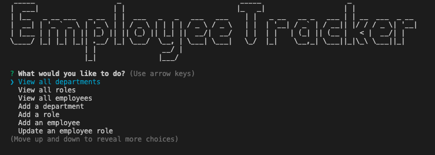

# employee-tracker

## Description
This is a command-line Employee Tracker CMS built using Node.JS and MySQL, with the help of the inquirer, MySQL2, and console.table packages. See video demo [HERE](https://drive.google.com/file/d/1ajSgI8dSkMNp08XDrcCPdwZ-D5acjBvl/view).

## Table of Contents 
* [Installation](#installation)
* [Usage](#usage)
* [License](#license)
* [Plans](#plans)
* [Tests](#tests)
* [Questions](#questions)

## Installation
* Start by creating and seeding the databases by running SOURCE schema.sql; and SOURCE seeds.sql;
* Change the .env.example to a .env file with your MySQL credentials:
* Type npm i on your terminal to install all dependencies

## Usage
See full video walkthrough [HERE]()
1. npm start to get started
2. Select your action of choice 
3. Follow the prompts 
4. You will get a confirmation message for each section once you have completed the flow
5. Select a different flow or select Exit Application to end the session

This has the following features:
* View all employees, departments, and roles
* Add a new employee, department, and role
* Update an employee's role 
* BONUS: View total costs by department, view employees by manager, view employees by department

## License
This project uses MIT license.

## Plans
Given more time, I would have loved to be able to do the following:
* Utilise module exports and classes to break up my code into different files / folders
* Have the ability to update and delete every single field
* Have data validation to be able to prevent duplicate entries
* Have proper Jest tests in place 

## Tests
No tests installed on this repo. 

## Questions
For any further questions, reach out to rpgarde@gmail.com or visit my [Github profile](https://github.com/rpgarde).